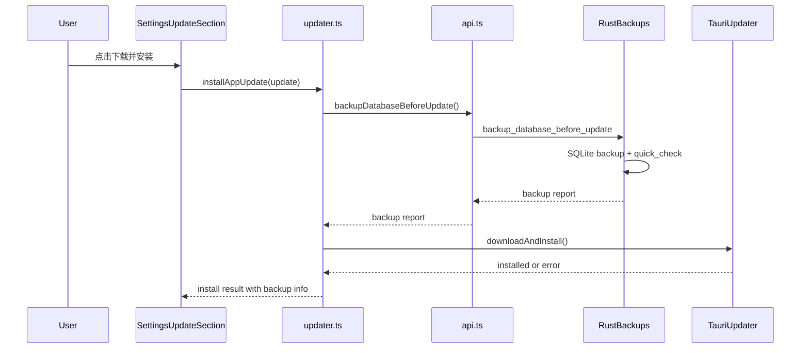

# Data Safety Design

Date: 2026-06-20

## Context

MikaVN Library is now a daily-use local Windows app with real data in `app-data`: the SQLite database, image cache, save backups, logs, and generated protection backups. The app already has manual database backup, pending database restore, restore-time protection backups, archive import protection, diagnostics, and backup cleanup.

The remaining high-value gap is update safety. The updater can download and install GitHub Releases, but the install flow currently calls `downloadAndInstall()` without first creating an app-managed database backup. If an update, migration, or install interruption causes trouble, the user should have a recent local database backup without needing to remember to create one manually.

This design covers the first data-safety increment only:

- automatic database backup before update installation;
- clearer backup and restore entry points;
- a default backup retention strategy;
- tests and validation for the above.

It does not implement cloud sync, WebDAV, full diagnostic package export, image repair, or performance optimization. Those remain separate increments.

## Goals

1. Before an app update is installed, create a verified database backup in the app-managed backup directory.
2. Make restore discoverable from Settings and Dashboard without changing the existing safe restore behavior.
3. Keep database backups from growing forever while preserving enough recent recovery points.
4. Preserve all existing data-location rules: updates must not delete, relocate, or rewrite `app-data` except for adding backup files and task/log records.
5. Keep failure behavior conservative: if the pre-update backup fails, the update install must not continue.

## Current State

Existing backend capabilities:

- `AppPaths::database_backups()` resolves `app-data/database-backups`.
- `enqueue_database_backup_task` creates manual backup tasks for user-chosen paths.
- `enqueue_database_restore_task` copies a selected backup into `pending-restore`.
- `apply_pending_database_restore` validates pending restore databases with `PRAGMA quick_check`, creates `database-restore-protection/before-restore-*.db`, then replaces `mikavn.db`.
- `database_backup_summary` includes app-managed backups plus restore/import protection backups.
- `cleanup_old_database_backups` keeps recent backup files by count and age.

Existing frontend capabilities:

- Settings local data section shows diagnostics, manual backup, restore, archive import/export, directory paths, and cleanup.
- Dashboard local safety panel summarizes database backup health and links into Settings.
- Update settings section checks, downloads, installs, and relaunches updates.

Gap:

- `src/services/updater.ts` installs an update directly through `update.downloadAndInstall()` and has no pre-update backup step.

## Recommended Approach

Use a dedicated synchronous backend command for update protection backup, then call it from the updater service before `downloadAndInstall()`.

This is preferred over reusing the existing manual backup task because update installation needs a clear yes/no gate. A background task can still be useful for audit history, but the updater must know whether the backup completed and passed validation before installation starts.

### Alternatives Considered

1. Reuse manual backup task and poll until completion.
   - Benefit: fewer backend primitives.
   - Cost: update flow becomes timing-dependent and harder to reason about.
   - Decision: reject for the first increment.

2. Create a backup only after update download succeeds.
   - Benefit: avoids backup work when download fails.
   - Cost: Tauri updater combines download and install in `downloadAndInstall()`, so there is no reliable safe point before install with the current API usage.
   - Decision: reject unless a future updater API split is adopted.

3. Backup the entire `app-data` directory before every update.
   - Benefit: protects images, logs, and save backups too.
   - Cost: large image caches make every update slow and storage-heavy.
   - Decision: defer. Database backup is the critical first protection; full archive export remains a manual action.

## Backend Design

Add a new database backup path:

- directory: `app-data/database-backups/update-protection`;
- file name: `before-update-YYYYMMDD-HHMMSS.db`.

Add a backend report type:

- `path`: full backup file path;
- `fileName`: backup file name;
- `sizeBytes`: copied backup size;
- `createdAt`: UTC timestamp;
- `quickCheck`: SQLite `PRAGMA quick_check` result.

Add a backend command:

- `backup_database_before_update() -> DatabaseUpdateProtectionBackupReport`.

Behavior:

1. Resolve `AppPaths` from the running app.
2. Ensure `database-backups/update-protection` exists.
3. Create a SQLite-consistent backup of `mikavn.db` into the timestamped file.
4. Validate the resulting backup with the same restore validation rules:
   - SQLite opens read-only;
   - `PRAGMA quick_check` returns `ok`;
   - `games` table exists.
5. Log success to diagnostic logs.
6. Return the backup report to the frontend.

The first implementation will not create a task record for update-protection backups. The command is a blocking pre-install gate, and diagnostics plus backup summary are enough for auditability in this increment. A task record can be added later if update progress reporting is expanded.

Failure:

- Return a normalized app error.
- Do not delete current `mikavn.db`.
- If a partially written target exists and validation fails, leave it in place only if it can aid diagnosis; otherwise move it to a rejected name inside the same folder.
- The frontend must not install the update after this command fails.

Retention:

- Existing cleanup should include `database-backups/update-protection` because it already recursively scans `database-backups`.
- Recognize `before-update-*.db` as a known database backup file.
- Default cleanup policy remains: keep latest 10 and keep anything from the last 30 days.

## Frontend Design

### Update Flow

Update installation becomes:

1. User clicks `下载并安装`.
2. UI enters `backing_up` or shows an installing status with explicit backup text.
3. Call `api.backupDatabaseBeforeUpdate()`.
4. Show the resulting backup file name or path in the update section.
5. Call `update.downloadAndInstall()`.
6. Show installed state and existing relaunch button.

If backup fails:

- Show a clear message: `更新前数据库备份失败，已取消安装。请先到本地数据页检查数据库和备份目录。`
- Keep the update handle so the user can retry after fixing the issue.
- Do not call `downloadAndInstall()`.

### Settings Local Data

Improve the local data section without changing its safe behavior:

- Rename or group `手动备份数据库` and `恢复数据库备份` under a clearer `数据库备份与恢复` area.
- Show latest backup file name/time when diagnostics are loaded.
- Add an `打开备份目录` action next to backup/restore controls.
- Keep restore wording explicit: restore is scheduled and applied after restart, and the app creates a protection backup before replacement.

### Dashboard Local Safety

Keep Dashboard lightweight:

- Continue showing backup status.
- Add a clearer restore/settings action label such as `备份与恢复`.
- If there are zero known database backups, keep this as an attention item.

## Data Flow

## Testing Plan

Rust tests:

- creates update-protection backup under `database-backups/update-protection`;
- uses `before-update-YYYYMMDD-HHMMSS.db` naming;
- validates generated backup with `quick_check`;
- cleanup candidate collection includes update-protection backups;
- invalid or missing database returns an error and does not report success.

Node/source tests:

- updater install flow calls backup before `downloadAndInstall`;
- backup failure prevents `downloadAndInstall`;
- install result exposes backup information for the UI;
- Settings update section includes pre-update backup status text;
- Settings local data section exposes backup/restore wording and backup directory action.

Validation commands:

- `npm run test:updater-release`;
- `npm run test:dashboard-personal`;
- targeted new Node tests if separate;
- `cargo test -q backup --manifest-path src-tauri/Cargo.toml`;
- `npm run release:validate:core`.

Manual smoke after implementation:

- launch installed app from `E:\MikaVN Library`;
- check for update if a test release is available;
- verify `E:\MikaVN Library\app-data\database-backups\update-protection\before-update-*.db` exists;
- verify images and existing database-backed library data still load after restart;
- verify Settings local data shows the new backup in diagnostics.

## Non-Goals

- No automatic restore without user confirmation.
- No deletion of real game install folders.
- No migration of `app-data` to another location.
- No cloud backup or public data upload.
- No image cache compaction in this increment.
- No broad UI redesign.

## Acceptance Criteria

This increment is done when:

1. Update installation cannot start until a verified update-protection database backup succeeds.
2. Backup failure leaves the app update uninstalled and gives a clear recovery message.
3. The update-protection backup appears in diagnostics and backup cleanup.
4. Settings exposes backup/restore and backup directory actions clearly.
5. Dashboard still directs the user to the backup/restore entry when database backups are missing or need attention.
6. Automated tests cover success and failure paths for the pre-update backup gate.
7. Release core validation passes.

## Open Decisions

These are fixed for the first implementation:

- Backup location: `app-data/database-backups/update-protection`.
- Retention default: keep latest 10 and anything from the last 30 days.
- Update behavior on backup failure: cancel update install.
- Restore behavior: still scheduled for next startup with protection backup; no instant restore.
